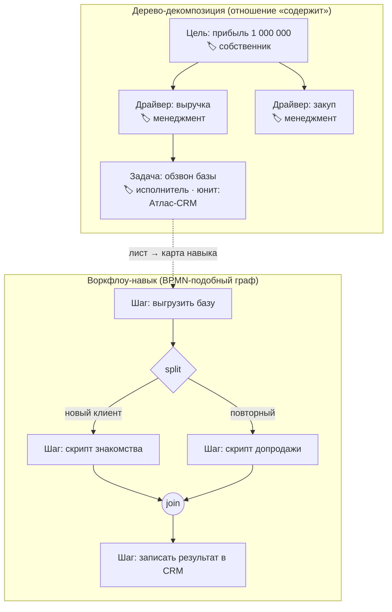
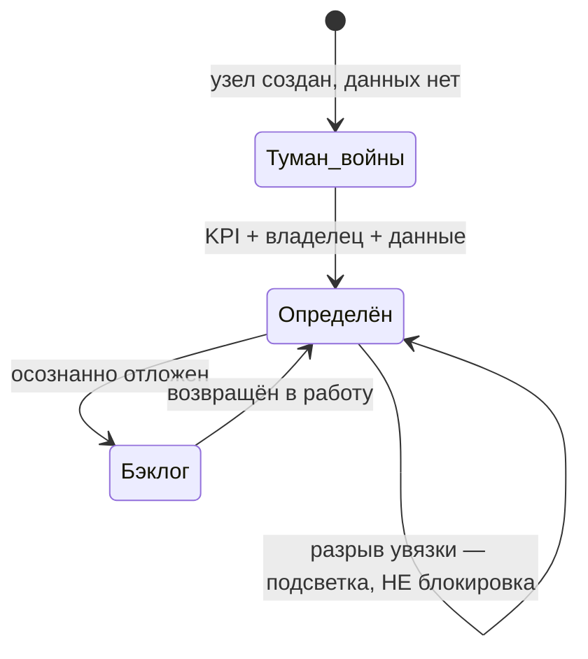
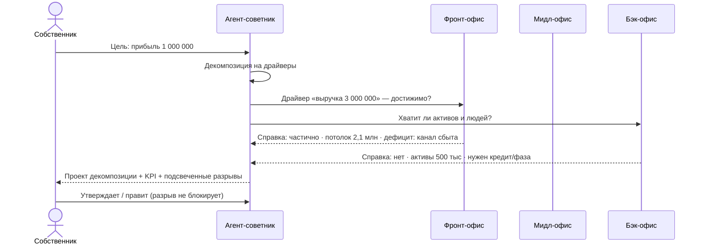

# Модель управления фирмой (Management Model)

**Версия:** 1.0
**Дата:** 2026-07-07
**Статус:** Canon — источник истины по модели управления
**Приоритет:** сразу после [PRD](PRD.md); при конфликте приоритет у PRD (выявленные расхождения — в разделе 8)
**Связанные документы:** [PRD](PRD.md), [Visual_Reference](../09_Design_System/Visual_Reference.md) (интерфейсная модель), [Entity_Platform](../05_Architecture/Entity_Platform.md), [Decision_Center](../04_Simulation/Decision_Center.md)

---

## 0. Назначение

Документ фиксирует согласованную модель управления фирмой: как цели декомпозируются, кто ими владеет, как требования сверяются с ресурсами и чем «навык» отличается от «компетенции». Это основа для последующих промптов реализации (M6+): всё, что здесь названо каноном, реализуется как описано; всё нерешённое вынесено в раздел 7 «Открытые вопросы» и не должно достраиваться догадками.

Ссылки на прототип в тексте указывают на текущий каркас `frontend/src/os/` (панель `CommandPanel.tsx`, данные `data.ts`) — это демо-заготовки, подлежащие оживлению, а не эталон реализации.

---

## 1. Два типа карт (Ф1)

В системе два разных полотна. Это **не** зум одного и того же холста — у каждого своя семантика узлов и связей.

### 1.1 Дерево-декомпозиция

Рекурсивная майнд-карта: цель дробится на подцели / этапы / задачи. Узлы связаны отношением «содержит» (PRD §14.4). Глубина вложенности свободная — модель не навязывает фиксированные уровни «стратегия → тактика → операции».

На каждом узле — **ролевой ярлык владельца**: `собственник` / `менеджмент` / `исполнитель`. Это именно ярлыки ответственности, а НЕ жёсткие уровни иерархии: узел с ярлыком «исполнитель» может лежать на любой глубине дерева.

В прототипе дерево уже рекурсивно: `OsGoal.stages: OsGoal[]` в `frontend/src/os/data.ts` — этап цели сам является целью с той же анатомией.

### 1.2 Воркфлоу-навык

Отдельный тип карты, прикрепляемый к **листьям** дерева: BPMN-подобный граф шагов с ветвлением (**split**), объединением (**join**) и условиями на переходах. Визуальный стиль — как n8n: узлы-шаги, явные стрелки переходов, метки условий.

В прототипе каркас переходов уже есть: `OsTransition { kind: 'seq' | 'split' | 'join', condition?, mode?: 'all' | 'any' }` в `data.ts`, рендер — `ProcessMap.tsx`.

### 1.3 Проваливание между картами

- Узел дерева → раскрывается в карту-декомпозицию уровнем ниже (то же дерево, фокус на поддереве).
- Лист дерева → раскрывается в карту навыка (другое полотно: шаги воркфлоу, а не подцели).

---

## 2. Роли и поток управления (Ф2)

1. **Собственник** ставит стратегическую цель с числом (например, «прибыль 1 000 000»).
2. **Менеджмент** раскладывает её на этапы-драйверы: выручка, закуп, накладные расходы и т.д.
3. **Исполнитель** превращает лист дерева в операционную задачу: назначает **юнит** (человек или ИИ-сотрудник — Единая рабочая сила, PRD §28) и прикрепляет **навык-воркфлоу** (раздел 1.2).

Роли — ярлыки на узлах (раздел 1.1); декомпозиция свободна по глубине: между «собственником» и «исполнителем» может быть сколько угодно уровней менеджмента — или ни одного.

В прототипе юниты и назначение ресурсов уже смоделированы: `OsUnit` (kind: `human | digital | hybrid | team | dept`) и `OsResource` (доля загрузки, стоимость) в `data.ts`.

---

## 3. Увязка (reconciliation) — мягко-жёсткая (Ф3)

### 3.1 Принцип

Система **предлагает**, человек **утверждает**. ИИ-советник при постановке цели предлагает декомпозицию на KPI и оценку требуемых ресурсов; человек утверждает или правит. Ничего не применяется автоматически без утверждения (согласуется с AI-управлением, PRD §38).

### 3.2 Ресурсный слой

Требования узлов сверяются с ресурсным слоем:

- **Персонал** — люди (и шире — юниты Единой рабочей силы);
- **Финансы** — активы / пассивы;
- **Прочие ресурсы** — по усмотрению советника: время, внимание руководителя, компетенции, инфраструктура. Не всё меряется деньгами.

### 3.3 Разрыв не блокирует

Обнаруженный разрыв (например, целевая выручка 3 000 000 при активах 500 000) **подсвечивается, но НЕ блокирует** работу с картой. Вместо блокировки узел живёт в одном из состояний определённости:

| Состояние | Что означает | Сигнал |
|---|---|---|
| **Туман войны** | Узел не определён: нет KPI, владельца или данных | «Здесь надо доработать» — зона без данных на карте |
| **Бэклог** | Узел определён, но осознанно отложен | Видимая пометка: решение «не сейчас» принято явно |

Оба состояния видимы на карте и служат сигналами внимания, а не ошибками. Важно: это **отдельное измерение «определённость»**, накладываемое поверх жизненного цикла Сущности (черновик → активная → … , PRD §14.3), а не замена ему.

В прототипе визуальные заготовки уже есть: элемент «туман войны» в `CommandPanel.tsx` (класс `fog`), проверки увязки — блок `advisorChecks` карточки цели в `data.ts` (measurability / связность / этап без KPI / этап без ответственного).

---

## 4. Увязка через опрос офисных агентов (Ф4)

### 4.1 Маршрутизация

**Агент-советник** при постановке цели декомпозирует её и **сам маршрутизирует** запросы к профильным офисам. Зашитых правил «драйвер X → офис Y» нет: советник решает, кого спрашивать, исходя из содержания драйвера. Один драйвер может опрашивать несколько офисов.

### 4.2 Офисные контуры

| Офис | Зона | Примеры вопросов |
|---|---|---|
| **Фронт** | рынок, продажи, клиенты | «Ёмкость рынка позволяет выручку 3 млн?» |
| **Мидл** | процессы, производство, операции | «Производство вытянет такой объём?» |
| **Бэк** | финансы, HR, ресурсы | «Хватит ли оборотных средств и людей?» |

### 4.3 Аналитическая справка

Офис-агент возвращает **аналитическую справку**, а не «да/нет»:

- достижимо: **да / частично / нет**;
- **реальный потолок** (насколько цель достижима текущими ресурсами);
- **в чём и на сколько дефицит**;
- **что нужно, чтобы закрыть дефицит**.

Справка — тоже Сущность (раздел 6): она прикрепляется к узлу, версионируется и остаётся в организационной памяти (PRD §25).

### 4.4 Все уровни декомпозиции

Советники работают на **всех** уровнях дерева — стратегия, тактика, операции — с разной глубиной проработки: на стратегическом уровне справка оценивает драйверы и потолки, на операционном — конкретные задачи и загрузку юнитов.

В прототипе каркас есть: панель советников в `frontend/src/os/data.ts` (`ADVISOR_SLOTS` — сейчас слоты «Финансист» и «Стратег» с демо-чатами) и детерминированные `advisorChecks`; контуры advisor/front/middle/back определены в [Visual_Reference §8](../09_Design_System/Visual_Reference.md). Оживление агентов — задача будущих промптов (roadmap M7–M8).

---

## 5. Навык ≠ Компетенция (Ф5)

Термины разводятся жёстко:

| | **Навык** | **Компетенция / оценка** |
|---|---|---|
| Что это | Устойчивый переиспользуемый воркфлоу: набор шагов → результат | Мера того, насколько набор навыков юнита покрывает требования задачи |
| Природа | Сущность-артефакт на карте навыков (раздел 1.2) | Вычисляемая оценка соответствия «юнит ↔ задача» |
| Пример | «Парсинг ТГ-каналов → оформление в Google Sheets» | «Агент покрывает 1 из 2 требуемых навыков» |

Сценарий разрыва: у ИИ-агента есть навык «парсинг», а задача требует ещё «рассылку» → система показывает разрыв компетенции: «агента надо доучить» → создаётся **новый навык-воркфлоу** (через Корпоративный университет, Visual_Reference §6), после освоения — разрыв закрыт.

**Правило переименования:** в ранних версиях прототипа «навык» со шкалой-пипсами 0–4 — это на самом деле **компетенция**; при реализации термин обязан быть переименован. Слово «навык» в UI и коде зарезервировано за воркфлоу-сущностью.

Связь с PRD §37 («Знания → Навыки → Компетенции»): цепочка PRD сохраняется, данный документ уточняет операционализацию — навык материализуется как воркфлоу, компетенция — как оценка покрытия (см. также раздел 8, п. 2).

---

## 6. Всё есть Сущность (Ф6)

Все объекты модели управления — первоклассные узлы единого графа знаний (PRD §14–§15). Карты из раздела 1 — **представления подграфов** Живого графа, а не отдельные хранилища.

| Объект модели управления | Entity (по Entity_Platform / PRD §14.1) |
|---|---|
| Цель / этап / драйвер / задача | Goal (рекурсивно, связь «содержит») |
| Навык-воркфлоу | Skill / Workflow |
| Компетенция (оценка покрытия) | Competency |
| Юнит | Human Employee / AI Employee / Team / Department |
| Ресурс (персонал, финансы, прочее) | Asset / Resource |
| Офис-агент, агент-советник | AI Employee (контур: advisor/front/middle/back) |
| Аналитическая справка | Document / Report (с историей версий) |
| Ролевой ярлык владельца | атрибут узла (владелец + разрешения, PRD §14.2) |
| Утверждение декомпозиции, ход | Decision (Decision_Center.md, раздел 3) |

Новых моделей данных вне Entity Platform не создаётся (Entity_Platform, раздел 20).

---

## 7. Открытые вопросы (Ф7)

Зафиксировано как нерешённое — не достраивать догадками:

1. **Формулы увязки.** Как именно считается «реальный потолок» и размер дефицита: детерминированные формулы, LLM-оценка или гибрид? Кто отвечает за воспроизводимость оценки?
2. **Единицы измерения прочих ресурсов.** Персонал и финансы измеримы; как квантифицировать «внимание руководителя», компетенции, инфраструктуру?
3. **Права ролей на редактирование чужих узлов.** Может ли исполнитель править узел с ярлыком «менеджмент»? Ярлыки — только семантика или ещё и модель прав? Как это соотносится с ролевой моделью MVP (владелец / менеджер / наблюдатель, MVP_Scope)?
4. **Порог «определённости» узла.** Какой минимум (KPI? владелец? данные? все три?) выводит узел из тумана войны — и кто это фиксирует: система автоматически или человек явно?
5. **Версионирование справок.** Устаревает ли аналитическая справка автоматически при изменении ресурсного слоя, или пере-опрос офисов запускается вручную?
6. **Каталог навыков.** Навыки глобальны для фирмы или принадлежат юнитам? Как работает переиспользование и Marketplace (PRD §39) для навыков-воркфлоу?
7. **Триггеры пере-увязки.** Когда система пересчитывает разрывы: по каждому изменению графа, по расписанию, по запросу?

---

## 8. Расхождения с PRD (для сведения; приоритет у PRD)

1. **Ролевые ярлыки vs ролевая модель MVP.** Собственник / менеджмент / исполнитель (этот документ) и владелец компании / менеджер / наблюдатель (MVP_Scope, PRD §48 «регистрация и роли») — два разных списка. Трактовка: ярлыки на узлах — семантика ответственности, роли MVP — модель доступа; связывание — открытый вопрос 3.
2. **Термин «навык».** PRD §37 определяет навык как «применение знаний» (свойство сущности-работника), этот документ — как переиспользуемый воркфлоу-артефакт. Содержательного конфликта нет (воркфлоу и есть материализованное применение), но при реализации терминов в коде/UI следовать разделу 5; если потребуется правка PRD §37 — только по явному запросу человека.
3. **Состояния «туман войны» / «бэклог».** В PRD §14.3 жизненный цикл сущности их не содержит. Трактовка: это дополнительное измерение «определённость» поверх жизненного цикла (раздел 3.3), а не новые стадии цикла — конфликта нет, но при реализации не смешивать с lifecycle.
4. **Геймификация.** PRD §40 (XP, уровни, бейджи) не является основой механик этой модели — механики здесь стратегические (ходы, туман войны, карта), как зафиксировано в Visual_Reference §9.
