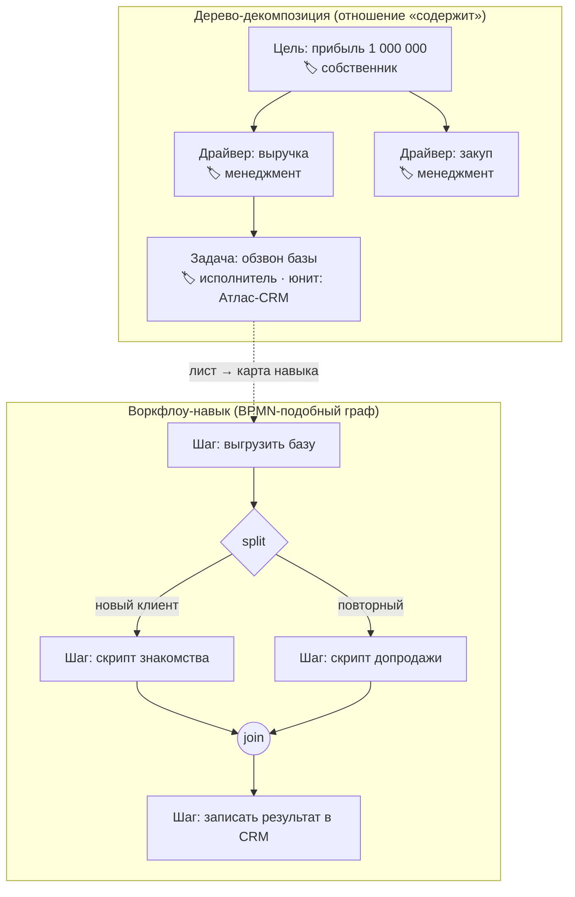
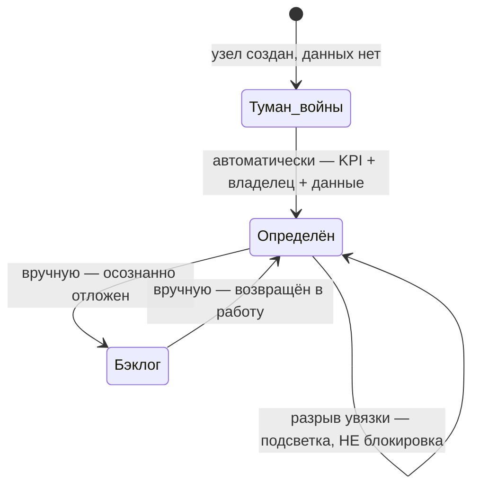
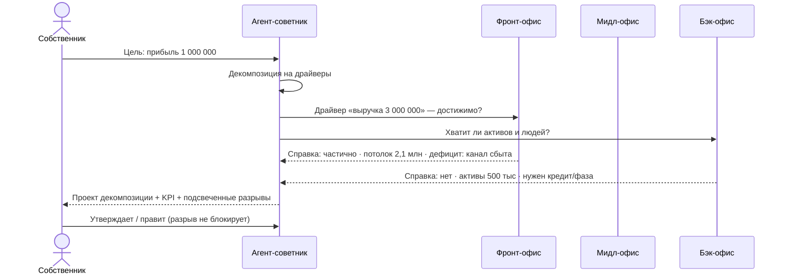
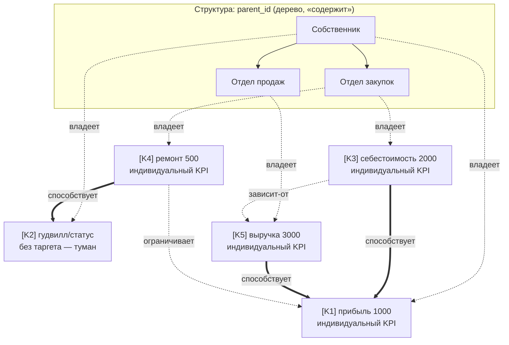
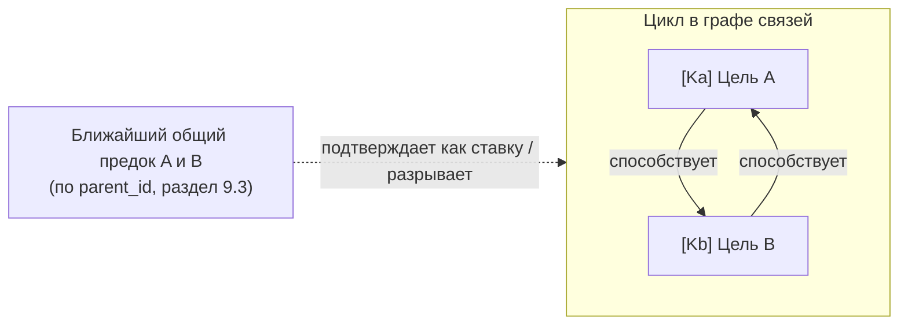

# Модель управления фирмой (Management Model)

**Версия:** 1.0
**Дата:** 2026-07-07
**Статус:** Canon — источник истины по модели управления
**Приоритет:** сразу после [PRD](PRD.md); при конфликте приоритет у PRD (выявленные расхождения — в разделе 8)
**Связанные документы:** [PRD](PRD.md), [Visual_Reference](../09_Design_System/Visual_Reference.md) (интерфейсная модель), [Entity_Platform](../05_Architecture/Entity_Platform.md), [Decision_Center](../04_Simulation/Decision_Center.md)

---

## 0. Назначение

Документ фиксирует согласованную модель управления фирмой: как цели декомпозируются, кто ими владеет, как требования сверяются с ресурсами и чем «навык» отличается от «компетенции». Это основа для последующих промптов реализации (M6+): всё, что здесь названо каноном, реализуется как описано; всё нерешённое вынесено в раздел 7 «Открытые вопросы» и не должно достраиваться догадками.

Ссылки на прототип в тексте указывают на текущий каркас `frontend/src/os/` (панель `CommandPanel.tsx`, данные `data.ts`) — это демо-заготовки, подлежащие оживлению, а не эталон реализации.

---

## 1. Два типа карт (Ф1)

В системе два разных полотна. Это **не** зум одного и того же холста — у каждого своя семантика узлов и связей.

### 1.1 Дерево-декомпозиция

Рекурсивная майнд-карта: цель дробится на подцели / этапы / задачи. Узлы связаны отношением «содержит» (PRD §14.4). Глубина вложенности свободная — модель не навязывает фиксированные уровни «стратегия → тактика → операции».

На каждом узле — **ролевой ярлык владельца**: `собственник` / `менеджмент` / `исполнитель`. Это именно ярлыки ответственности, а НЕ жёсткие уровни иерархии: узел с ярлыком «исполнитель» может лежать на любой глубине дерева.

В прототипе дерево уже рекурсивно: `OsGoal.stages: OsGoal[]` в `frontend/src/os/data.ts` — этап цели сам является целью с той же анатомией.

**Уточнение (раздел 9, ADR-0003):** «содержит» — это **структурная** принадлежность узла дереву (в каком отделе/подцели он административно живёт), не смысловая привязка его цели. К какой вышестоящей цели узел реально «работает» — отдельная связь между KPI-сущностями (раздел 9), которая может вести к любому вышестоящему узлу, не обязательно к структурному родителю.

### 1.2 Воркфлоу-навык

Отдельный тип карты, прикрепляемый к **листьям** дерева: BPMN-подобный граф шагов с ветвлением (**split**), объединением (**join**) и условиями на переходах. Визуальный стиль — как n8n: узлы-шаги, явные стрелки переходов, метки условий.

В прототипе каркас переходов уже есть: `OsTransition { kind: 'seq' | 'split' | 'join', condition?, mode?: 'all' | 'any' }` в `data.ts`, рендер — `ProcessMap.tsx`.

### 1.3 Проваливание между картами

- Узел дерева → раскрывается в карту-декомпозицию уровнем ниже (то же дерево, фокус на поддереве).
- Лист дерева → раскрывается в карту навыка (другое полотно: шаги воркфлоу, а не подцели).



---

## 2. Роли и поток управления (Ф2)

1. **Собственник** ставит стратегическую цель с числом (например, «прибыль 1 000 000»).
2. **Менеджмент** раскладывает её на этапы-драйверы: выручка, закуп, накладные расходы и т.д.
3. **Исполнитель** превращает лист дерева в операционную задачу: назначает **юнит** (один из четырёх атомарных типов исполнителя — сотрудник / агент / вне контура / устройство, ADR-0006 — Единая рабочая сила, PRD §28) и прикрепляет **навык-воркфлоу** (раздел 1.2).

Роли — ярлыки на узлах (раздел 1.1); декомпозиция свободна по глубине: между «собственником» и «исполнителем» может быть сколько угодно уровней менеджмента — или ни одного.


В прототипе юниты и назначение ресурсов уже смоделированы: `OsUnit` (kind: `human | digital | hybrid | team | dept`) и `OsResource` (доля загрузки, стоимость) в `data.ts` — этот прототипный enum **заменён** каноном ADR-0006 (`employee | agent | external | device`; `hybrid` не переносится, `team`/`dept` — не kind, а надстройка группировки, решённая ADR-0007: `department` — строгое дерево, `team` — m2m-оверлей).

**Уточнение (раздел 9, ADR-0003):** шаг 2 «раскладывает на этапы-драйверы» обычно совмещает два действия — создание структурного узла (parent_id) и типичный случай «сверху вниз», когда родитель сразу спускает вниз командную цель = ссылку на свой KPI (раздел 9.3). Но это не единственный путь: узел может получить смысловую связь позже и не обязательно к KPI своего структурного родителя (раздел 9.2).

---

## 3. Увязка (reconciliation) — мягко-жёсткая (Ф3)

### 3.1 Принцип

Система **предлагает**, человек **утверждает**. ИИ-советник при постановке цели предлагает декомпозицию на KPI и оценку требуемых ресурсов; человек утверждает или правит. Ничего не применяется автоматически без утверждения (согласуется с AI-управлением, PRD §38).

**Срез (ADR-0002):** в первом кодовом срезе (Goal Entity + ресурсы на узлах) увязка **детерминированная** — без вызовов LLM, только арифметика (сумма/доступно/разрыв, §3.2). Аналитические справки офисных агентов с LLM-оценкой достижимости (раздел 4) — поздний срез (roadmap M7–M8); см. §7, вопрос 1.

### 3.2 Ресурсный слой

Требования узлов сверяются с ресурсным слоем:

- **Персонал** — люди (и шире — юниты Единой рабочей силы);
- **Финансы** — активы / пассивы;
- **Прочие ресурсы** — по усмотрению советника: время, внимание руководителя, компетенции, инфраструктура. Не всё меряется деньгами.

**Квантификация (первый срез, ADR-0002, §7 вопрос 2):** `resource.kind ∈ {people, money, other}`.

- `people` — загрузка юнита в % (в прототипе — `OsResource.load`, раздел 2);
- `money` — сумма в валюте;
- `other` — текстовое требование без числа (внимание руководителя, компетенции, инфраструктура); в первом срезе участвует в увязке как флаг «требование есть», не как измеримая величина.

### 3.3 Разрыв не блокирует

Обнаруженный разрыв (например, целевая выручка 3 000 000 при активах 500 000) **подсвечивается, но НЕ блокирует** работу с картой. Вместо блокировки узел живёт в одном из состояний определённости:

| Состояние | Что означает | Сигнал |
|---|---|---|
| **Туман войны** | Узел не определён: нет KPI, владельца или данных | «Здесь надо доработать» — зона без данных на карте |
| **Бэклог** | Узел определён, но осознанно отложен | Видимая пометка: решение «не сейчас» принято явно |

Оба состояния видимы на карте и служат сигналами внимания, а не ошибками. Важно: это **отдельное измерение «определённость»**, накладываемое поверх жизненного цикла Сущности (черновик → активная → … , PRD §14.3), а не замена ему.

**Правило перехода (первый срез, ADR-0002, §7 вопрос 4):** «туман»/«определён» вычисляется **автоматически** — узел «в тумане», если отсутствует хотя бы один из трёх (KPI, владелец, данные); «определён», когда присутствуют все три. «Бэклог» — единственное **ручное** состояние: система никогда не переводит узел в бэклог сама, это осознанный флаг человека.

В прототипе визуальные заготовки уже есть: элемент «туман войны» в `CommandPanel.tsx` (класс `fog`), проверки увязки — блок `advisorChecks` карточки цели в `data.ts` (measurability / связность / этап без KPI / этап без ответственного).



---

## 4. Увязка через опрос офисных агентов (Ф4)

> **Срез (ADR-0002):** этот раздел описывает **поздний срез** (roadmap M7–M8), реализуемый после детерминированного ядра увязки (раздел 3). Первый кодовый срез Goal Entity считает только арифметику §3.2 — без LLM, без офисных агентов, без справок ниже.

### 4.1 Маршрутизация

**Агент-советник** при постановке цели декомпозирует её и **сам маршрутизирует** запросы к профильным офисам. Зашитых правил «драйвер X → офис Y» нет: советник решает, кого спрашивать, исходя из содержания драйвера. Один драйвер может опрашивать несколько офисов.

### 4.2 Офисные контуры

| Офис | Зона | Примеры вопросов |
|---|---|---|
| **Фронт** | рынок, продажи, клиенты | «Ёмкость рынка позволяет выручку 3 млн?» |
| **Мидл** | процессы, производство, операции | «Производство вытянет такой объём?» |
| **Бэк** | финансы, HR, ресурсы | «Хватит ли оборотных средств и людей?» |

### 4.3 Аналитическая справка

Офис-агент возвращает **аналитическую справку**, а не «да/нет»:

- достижимо: **да / частично / нет**;
- **реальный потолок** (насколько цель достижима текущими ресурсами);
- **в чём и на сколько дефицит**;
- **что нужно, чтобы закрыть дефицит**.

Справка — тоже Сущность (раздел 6): она прикрепляется к узлу, версионируется и остаётся в организационной памяти (PRD §25). Формула «реального потолка» — предмет позднего среза (§7, вопрос 1); первый срез её не вычисляет.

### 4.4 Все уровни декомпозиции

Советники работают на **всех** уровнях дерева — стратегия, тактика, операции — с разной глубиной проработки: на стратегическом уровне справка оценивает драйверы и потолки, на операционном — конкретные задачи и загрузку юнитов.



В прототипе каркас есть: панель советников в `frontend/src/os/data.ts` (`ADVISOR_SLOTS` — сейчас слоты «Финансист» и «Стратег» с демо-чатами) и детерминированные `advisorChecks`; контуры advisor/front/middle/back определены в [Visual_Reference §8](../09_Design_System/Visual_Reference.md). Оживление агентов — задача будущих промптов (roadmap M7–M8).

---

## 5. Навык ≠ Компетенция (Ф5)

Термины разводятся жёстко:

| | **Навык** | **Компетенция / оценка** |
|---|---|---|
| Что это | Устойчивый переиспользуемый воркфлоу: набор шагов → результат | Мера того, насколько набор навыков юнита покрывает требования задачи |
| Природа | Сущность-артефакт на карте навыков (раздел 1.2) | Вычисляемая оценка соответствия «юнит ↔ задача» |
| Пример | «Парсинг ТГ-каналов → оформление в Google Sheets» | «Агент покрывает 1 из 2 требуемых навыков» |

Сценарий разрыва: у ИИ-агента есть навык «парсинг», а задача требует ещё «рассылку» → система показывает разрыв компетенции: «агента надо доучить» → создаётся **новый навык-воркфлоу** (через Корпоративный университет, Visual_Reference §6), после освоения — разрыв закрыт.

**Правило переименования:** в ранних версиях прототипа «навык» со шкалой-пипсами 0–4 — это на самом деле **компетенция**; при реализации термин обязан быть переименован. Слово «навык» в UI и коде зарезервировано за воркфлоу-сущностью.

Связь с PRD §37 («Знания → Навыки → Компетенции»): цепочка PRD сохраняется, данный документ уточняет операционализацию — навык материализуется как воркфлоу, компетенция — как оценка покрытия (см. также раздел 8, п. 2).

---

## 6. Всё есть Сущность (Ф6)

Все объекты модели управления — первоклассные узлы единого графа знаний (PRD §14–§15). Карты из раздела 1 — **представления подграфов** Живого графа, а не отдельные хранилища.

| Объект модели управления | Entity (по Entity_Platform / PRD §14.1) |
|---|---|
| Цель / этап / драйвер / задача | Goal (рекурсивно, связь «содержит») |
| Навык-воркфлоу | Skill / Workflow |
| Компетенция (оценка покрытия) | Competency |
| Юнит | Employee / Agent / External / Device (атомарные типы, ADR-0006); группы Team/Department — `unit_group`, ADR-0007 |
| Ресурс (персонал, финансы, прочее) | Asset / Resource |
| Офис-агент, агент-советник | AI Employee (контур: advisor/front/middle/back) |
| Аналитическая справка | Document / Report (с историей версий) |
| Ролевой ярлык владельца | атрибут узла (владелец + разрешения, PRD §14.2); владение целью — теперь `unit_id` (ADR-0006), не текст |
| Утверждение декомпозиции, ход | Decision (Decision_Center.md, раздел 3) |

Новых моделей данных вне Entity Platform не создаётся (Entity_Platform, раздел 20).

---

## 7. Увязка: статус открытых вопросов (Ф7)

**Обновлено:** 2026-07-08 · **ADR:** [`docs/adr/0002-reconciliation-first-slice.md`](../../adr/0002-reconciliation-first-slice.md)

Первый кодовый срез — **Goal Entity (дерево декомпозиции) + ресурсы на узлах + детерминированная увязка** (арифметика, без LLM). Аналитические справки офисных агентов через LLM (раздел 4) — отдельный поздний срез (roadmap M7–M8). Под этот scope 4 из 7 вопросов ниже решены; 3 — осознанно отложены с указанием, до какого среза. Нумерация вопросов сохранена из исходной постановки (на неё ссылается раздел 8).

### 7.1 Решено (первый срез)

1. **Формулы увязки.** *Вопрос:* как именно считается «реальный потолок» и размер дефицита — детерминированные формулы, LLM-оценка или гибрид? Кто отвечает за воспроизводимость оценки?
   **Решение:** первый срез — детерминированное ядро без LLM: сумма ресурсов детей vs родитель, сумма требований узла vs доступно, разрыв = разница (см. §3.2). LLM-оценка «реального потолка» и аналитические справки офисных агентов (§4.3) — отдельный поздний срез (roadmap M7–M8), после детерминированного ядра.

2. **Единицы измерения прочих ресурсов.** *Вопрос:* персонал и финансы измеримы; как квантифицировать «внимание руководителя», компетенции, инфраструктуру?
   **Решение:** `resource.kind ∈ {people, money, other}`. `people` — загрузка юнита в % (см. §3.2); `money` — сумма в валюте; `other` — текстовое требование без числа (внимание руководителя, компетенции, инфраструктура) — в первом срезе не квантифицируется, участвует в увязке как флаг «требование есть», не как число. Дальнейшая детализация — по мере практической потребности.

4. **Порог «определённости» узла.** *Вопрос:* какой минимум (KPI? владелец? данные? все три?) выводит узел из тумана войны — и кто это фиксирует: система автоматически или человек явно?
   **Решение:** автодетекция системой. Узел — «в тумане», если отсутствует хотя бы один из трёх: KPI, владелец, данные. Узел — «определён», когда присутствуют все три (см. §3.3). «Бэклог» — **не** авто-состояние: единственный переход, который система никогда не делает сама, — это ручной флаг человека («осознанно не сейчас»).
   **Уточнение (ADR-0006):** с этим ADR критерий «владелец» — это «назначен юнит» (`goal.unit_id` заполнен), а не текст в `entity.owner`; сама постановка вопроса и решение не пересматриваются.

7. **Триггеры пере-увязки.** *Вопрос:* когда система пересчитывает разрывы: по каждому изменению графа, по расписанию, по запросу?
   **Решение:** пересчёт **на каждое изменение** узла или ресурса. Дерево первого среза небольшое, пересчёт дешёвый и остаётся всегда актуальным. Расписание или явный триггер по запросу вводится позже, когда в пересчёт начнут включаться дорогие LLM-справки офисных агентов (§4).

### 7.2 Отложено

3. **Права ролей на редактирование чужих узлов.** *Вопрос:* может ли исполнитель править узел с ярлыком «менеджмент»? Ярлыки — только семантика или ещё и модель прав? Как это соотносится с ролевой моделью MVP (владелец / менеджер / наблюдатель, MVP_Scope)?
   **Статус:** отложено до среза аутентификации и ролей доступа. В первом срезе ярлыки собственник/менеджмент/исполнитель — чистая семантика ответственности, БЕЗ модели прав: любой может редактировать любой узел. Модель прав появится вместе с MVP-ролями.

5. **Версионирование справок.** *Вопрос:* устаревает ли аналитическая справка автоматически при изменении ресурсного слоя, или пере-опрос офисов запускается вручную?
   **Статус:** отложено до среза офисных агентов (roadmap M7–M8) — справок как сущностей в первом срезе не существует.

6. **Каталог навыков.** *Вопрос:* навыки глобальны для фирмы или принадлежат юнитам? Как работает переиспользование и Marketplace (PRD §39) для навыков-воркфлоу?
   **Статус:** отложено до среза навыков-воркфлоу (листовой слой, раздел 1.2) — каталог не существует, пока навыки не реализованы как сущности.

---

## 8. Расхождения с PRD (для сведения; приоритет у PRD)

1. **Ролевые ярлыки vs ролевая модель MVP.** Собственник / менеджмент / исполнитель (этот документ) и владелец компании / менеджер / наблюдатель (MVP_Scope, PRD §48 «регистрация и роли») — два разных списка. Трактовка: ярлыки на узлах — семантика ответственности, роли MVP — модель доступа; связывание — открытый вопрос 3.
2. **Термин «навык».** PRD §37 определяет навык как «применение знаний» (свойство сущности-работника), этот документ — как переиспользуемый воркфлоу-артефакт. Содержательного конфликта нет (воркфлоу и есть материализованное применение), но при реализации терминов в коде/UI следовать разделу 5; если потребуется правка PRD §37 — только по явному запросу человека.
3. **Состояния «туман войны» / «бэклог».** В PRD §14.3 жизненный цикл сущности их не содержит. Трактовка: это дополнительное измерение «определённость» поверх жизненного цикла (раздел 3.3), а не новые стадии цикла — конфликта нет, но при реализации не смешивать с lifecycle.
4. **Геймификация.** PRD §40 (XP, уровни, бейджи) не является основой механик этой модели — механики здесь стратегические (ходы, туман войны, карта), как зафиксировано в Visual_Reference §9.
5. **Типы юнита.** PRD §28 (Единая рабочая сила) перечисляет команды/отделы/мульти-агентные команды как формы юнита. Этот документ (раздел 2, 6; ADR-0006) фиксирует четыре **атомарных** типа исполнителя — сотрудник/агент/вне контура/устройство; team/dept — не kind, а надстройка группировки поверх атомарных юнитов, решённая ADR-0007 (`department` — дерево, `team` — m2m-оверлей). Конфликта нет: операционализация по прецеденту раздела 5 (PRD §37 vs термин «навык»), сам PRD не редактируется.

---

## 9. KPI-сущность и связи целей (Ф8)

**Добавлено:** 2026-07-08 · **ADR:** [`docs/adr/0003-kpi-entity-and-goal-alignment.md`](../../adr/0003-kpi-entity-and-goal-alignment.md)
**Расширено:** 2026-07-08 · **ADR:** [`docs/adr/0004-goal-link-types-cycles-composite-kpi.md`](../../adr/0004-goal-link-types-cycles-composite-kpi.md) (типы связей, жизненный цикл связи, направленность/циклы/судья, составной KPI — §9.9–9.12; там же — актуальные открытые вопросы раздела)

Раздел фиксирует модель KPI и того, как цели узлов связаны друг с другом смыслово — отдельно от структурной принадлежности дерева (раздел 1.1). Это канон для будущих Шагов 2b/3/3b (см. `BACKLOG.md`; Шаги 2a/2b уже реализованы); реализация не должна домысливать то, что здесь не решено (раздел 9.8, ADR-0004 «Открытые вопросы»).

### 9.1 KPI — Сущность

По принципу «Всё есть Сущность» (раздел 6, PRD §14) KPI — не поле цели, а отдельная Сущность со своим стабильным ID, которая задаётся при постановке/описании цели: измеримая оценка = число + единица + таргет — либо таргета нет (тогда узел в тумане, раздел 9.5).

### 9.2 Индивидуальная цель vs командная цель

У узла дерева (раздел 1.1) цель бывает одного из двух типов:

- **Индивидуальная** — узел заводит собственный KPI (новая Сущность-KPI, которой он владеет).
- **Командная** — у узла нет собственного KPI; вместо этого — **ссылка на конкретный индивидуальный KPI вышестоящего узла**, не копия значения. Изменение числа у источника автоматически отражается у всех, кто на него ссылается.

### 9.3 Два независимых отношения

Ключевое разведение модели — два ортогональных отношения:

- **Структура** (`parent_id`, self-FK на Goal) — «в каком отделе живёт узел». Строгая иерархия: один родитель на узел, отношение «содержит» (раздел 1.1). Административная принадлежность, не смысл.
- **Связи целей** (граф KPI → KPI) — «эта цель работает на ту». Отдельные направленные ссылки между индивидуальными KPI-сущностями. Связь может вести к **любому** вышестоящему KPI, не обязательно к KPI структурного родителя — это граф поверх дерева структуры, а не его функция.

Узел, структурно вложенный в один отдел, смысловой связью может работать на цель совсем другой ветви — см. пример (раздел 9.6).

### 9.4 Направление создания связи

Связь работает в обе стороны:

- **сверху вниз** — родитель (или система) спускает цель: у ребёнка создаётся командная цель = ссылка на KPI родителя;
- **снизу вверх** — инициатива узла сама цепляется к вышестоящему KPI: «зачем это делаем → к какой цели ведёт».

### 9.5 Сиротство — два вида, оба подсвечиваются

- **Инициатива без связи вверх.** У узла есть цель/задача, не привязанная ни к какому вышестоящему KPI. Сигнал: «зачем это?».
- **Индивидуальный KPI без исполнителя снизу.** На KPI никто не ссылается командной целью. Сигнал: «кто это сделает / под неё нет команды».

### 9.6 Взаимодействие с туманом

KPI без числового таргета (пример — «гудвилл/статус», мерить нечем) не проходит критерий определённости узла (раздел 3.3, §7 вопрос 4) → узел остаётся в тумане; связь к такому KPI подсвечивает это дальше по графу связей. Механика тумана уже специфицирована в разделе 3.3 — до-строек не требуется.

### 9.7 Канонический пример

```
Собственник
  • [K1] прибыль 1000
  • [K2] гудвилл/статус        (числового таргета нет → в тумане)

Отдел закупок   (parent_id → Собственник)   ← структура
  • [K3] себестоимость 2000    ──связь──▶ [K1] прибыль
  • [K4] ремонт 500            ──связь──▶ [K2] гудвилл   ← НЕ прибыль, другая ветвь смысла

Отдел продаж    (parent_id → Собственник)
  • [K5] выручка 3000          ──связь──▶ [K1] прибыль
```

`[K4] ремонт` структурно живёт в закупках (под собственником), но **работает на гудвилл, а не на прибыль** — в строгом дереве такое было бы невозможно; граф связей это допускает.



Тонкие пунктирные рёбра «владеет» — структурная принадлежность KPI своему узлу (не путать со связью целей). Связи целей теперь показаны по типу (раздел 9.9): жирные рёбра — «способствует», тонкие пунктирные с подписью — «ограничивает»/«зависит-от». `[K4]→[K2]` намеренно пересекает ветви дерева. `[K4] ремонт` участвует сразу в двух связях разных типов — способствует `[K2]` гудвиллу и одновременно ограничивает `[K1]` прибыль (тратит из общего бюджета) — иллюстрация множественности связей одного KPI (раздел 9.10). `[K3] себестоимость --зависит-от--> [K5] выручка` — продажи не спланировать без отчёта по себестоимости (раздел 9.9).

### 9.8 Оставшиеся напряжения

- **Название раздела 1 «Дерево-декомпозиция».** Название по-прежнему подразумевает, что дробление = совпадает со смыслом; после этого раздела это верно только для структуры, не для смысловой связи. Переименование раздела 1 в объём этой задачи не входит — оставлено как терминологическое трение.
- **Две независимые оси агрегации.** Свёртка ресурсов по структуре (ADR-0002, раздел 3.2: «сумма ресурсов детей vs родитель») и смысловая увязка целей по графу KPI→KPI (этот раздел) — разные оси, посчитанные независимо. Узел может быть «в порядке» по ресурсной свёртке своей структурной ветви и одновременно не двигать никакую вышестоящую цель по графу связей (или наоборот). Как эти два сигнала показывать вместе на карте — не решено, прорабатывается на Шаге 3 (см. ADR-0003). **Дополнение (ADR-0004):** у связей теперь есть тип (раздел 9.9) — «ограничивает» по смыслу ближе к ресурсной оси (конкуренция за бюджет), «способствует»/«зависит-от» — к смысловой; вопрос визуализации осей теперь включает ещё и вопрос, как показать разные типы рёбер одновременно с обеими осями. Остаётся открытым (см. ADR-0004 «Открытые вопросы»).
- Дальнейшие открытые вопросы (не решать здесь) — `docs/adr/0003-kpi-entity-and-goal-alignment.md` (закрыты ADR-0004) и `docs/adr/0004-goal-link-types-cycles-composite-kpi.md`, раздел «Открытые вопросы» (актуальные).

### 9.9 Типы связи (Р1, ADR-0004)

Каждая связь графа (раздел 9.3) имеет **тип**. Стартовый набор — три; новые типы добавляются ТОЛЬКО под конкретный сценарий, который в эти три не укладывается — не плодить типологию впрок.

| Тип | Смысл | Направление стрелки | Пример |
|---|---|---|---|
| **способствует** (`contributes`) | Вклад в ценность цели-получателя | от узла-источника к цели, которую он двигает | `[K4] ремонт --способствует--> [K2] гудвилл` |
| **ограничивает** (`constrains`) | Конкурирует за общий ресурс/бюджет с целью-получателем | от узла-источника к цели, за чей бюджет/ресурс он конкурирует | `[K4] ремонт --ограничивает--> [K1] прибыль` (тратит из того же бюджета) |
| **зависит-от** (`depends_on`) | Предусловие/вход: цель-потребитель не может двигаться без цели-источника | от предусловия к зависимой цели | `[K3] себестоимость --зависит-от--> [K5] выручка` (продажи не спланировать без отчёта по себестоимости) |

Одна и та же KPI-сущность может одновременно быть источником нескольких связей разных типов — `[K4] ремонт` из канонического примера (раздел 9.7) способствует гудвиллу и ограничивает прибыль одновременно (см. диаграмму раздела 9.7 и раздел 9.10 — множественность).

### 9.10 Множественность и жизненный цикл связи (Р1, Р2, ADR-0004)

Один KPI может быть источником сразу нескольких связей и одновременно потребителем связей от нескольких нижестоящих KPI — множественность в обе стороны, ограничений на число связей нет.

KPI — источник истины для связи: **связь существует, пока существуют оба её конца**. Удаление любого конца (источника или потребителя) **каскадно удаляет связь как сущность** — метрика стала неактуальной, увязка к ней теряет смысл. Никаких «осиротевших» ссылок, никаких запретов на удаление KPI из-за существующих связей.

**Следствие для реализации:** это делает переход `patch_goal` с replace-all (удалить все KPI цели и пересоздать) на **diff-sync** (сопоставлять KPI по id, обновлять на месте, трогать только дельту) обязательным условием ДО появления связей — иначе каждый патч цели молча удаляет связи вместе с пересоздаваемыми KPI. Задача уже в `BACKLOG.md`; здесь фиксируется причина, почему она блокирует Шаг 3, а не является отдельной оптимизацией.

### 9.11 Направленность, циклы, судья (Р3, ADR-0004)

Связи **разнонаправленные** — правила «только вверх» нет. Направление стрелки определяется типом (раздел 9.9): «способствует»/«ограничивает» обычно (но не обязательно) идут от узла вверх, к цели, которую он двигает или с которой конкурирует за ресурс; «зависит-от» идёт от предусловия к зависимой цели независимо от структурного положения обоих узлов — вбок, вниз, куда угодно.

**Циклы не запрещаются.** Граф связей может содержать циклы (KPI A способствует B, B способствует A) — система их **детектирует и подсвечивает** как риск «работа по кругу / работа ради работы», а не блокирует создание связи, замыкающей цикл.

**Судья цикла — ближайший общий структурный предок.** Разрешить цикл (подтвердить как осознанную ставку — НИОКР, разведка: «прямой связи с прибылью нет, но а вдруг выстрелит», — снимая тревогу) или разорвать его может только тот, кто структурно стоит над всеми узлами цикла: **ближайший общий предок узлов цикла по дереву `parent_id`** (раздел 1.1 / 9.3, Шаг 2b). Подтверждение цикла — ручной флаг поверх авто-детекта, та же философия, что ручной «бэклог» (раздел 3.3): система находит и подсвечивает, человек с полномочиями решает.

**Ключевой смысл:** граф связей (раздел 9.3) ставит вопрос — «нашёлся цикл»; дерево структуры (раздел 1.1) назначает ответственного — «кто вправе на него ответить». Две сознательно разведённые оси модели (раздел 9.3) здесь впервые работают вместе, а не параллельно.



### 9.12 Составной KPI (Р4, Шаг 3b, ADR-0004)

Качественная цель без прямого числа (пример — «гудвилл», «новый офис») раскладывается на **факторы-KPI с весами**; значение составного KPI = взвешенная сумма факторов.

```
[K2] гудвилл    = 0.3·(динамика отзывов) + 0.3·(LTV) + 0.4·(динамика брака)
[Kn] новый офис = 0.3·(аренда) + 0.3·(удалённость) + 0.4·(депозит)
```

**Составной KPI — это KPI (раздел 9.1), чьё значение собирается из дочерних KPI через веса, а не задаётся числом напрямую.** Новой сущности не требуется — KPI уже сущность с Шага 2a; составной KPI — просто KPI без собственного таргета, с формулой из факторов вместо него.

**Правило тумана расширяется:** узел определён, если у его KPI есть таргет **ИЛИ** есть формула из факторов, каждый из которых сам измерим (раздел 3.3, §7 вопрос 4).

**Срез:** это не структурная перестройка модели, а инструмент **«решения в моменте»** — применяется точечно, когда конкретную качественную цель нужно разложить на измеримое, а не вводится сразу для всех KPI. Отдельный **Шаг 3b**, после Шага 3 (связи).

### 9.13 План и факт — на будущее

Текущая модель везде оперирует **планом**: `target` KPI — это то, что хотим (раздел 9.1). Отдельного измерения **факта** («сколько на самом деле») пока нет, а разница план↔факт — по сути и есть центральный смысл увязки. Факт не вводится вручную (за редким исключением) — он **тянется из ресурсного блока** (Финансы, Персонал и т.д.), которых в модели пока не существует: строить факт до появления ресурсных блоков нельзя. Направление, примеры источников и открытые вопросы зафиксированы в [`docs/adr/0005-plan-vs-fact-and-resource-blocks.md`](../../adr/0005-plan-vs-fact-and-resource-blocks.md) (Proposed) — это задел на будущую веху, не текущий срез; граф связей (раздел 9.9–9.11) и составной KPI (раздел 9.12) сейчас работают только с планом и не меняются.
